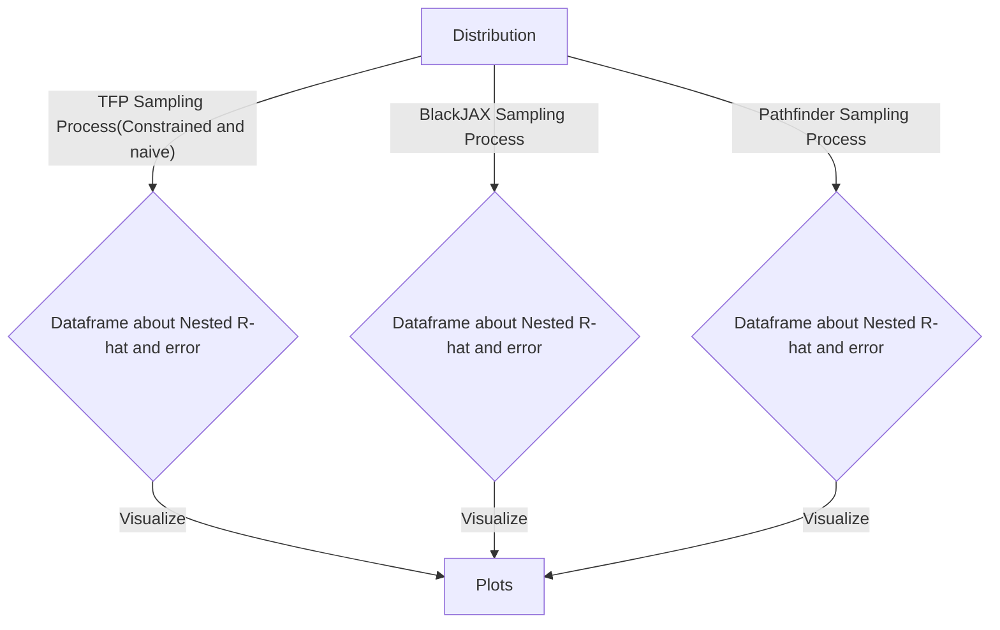

# Many-Short-Chain MCMC: An Investigation of Convergence Diagnostics and Initialization Strategies

This repository contains code and experiments for my Master's degree Capstone Project.

Thr project is a continuation of my summer self-initiated research project

> _Many-Short-Chain MCMC: An Investigation of Convergence Diagnostics and Initialization Strategies_

[Link to the Git Repo](https://github.com/JustinTrenchcoat/Bayesian_Summer_2026)

The above project will be referred as "the summer project" for later context. This page also host most of the code used in the summer project, with a more organzied way.

## Project Overview

The project has three main objectives:
1. Systematically investigate the stagnation phenomenon discovered in the summer project. 
2. Evaluate nested $\widehat{R}$ under various target distributions.
3. Systematically assess initialization strategies for many-short-chain MCMC

## Project status

- [ ] Finalize Experiment Design
- [ ] Validate Implementations and Establish Baseline Experiments
- [ ] Investigate MVN with isotropic and AR(1) covariances
- [ ] Further Experiments with Various Target Distributions
- [ ] Analyze and Visualize Nested $\widehat{R}$, Sampling Error and Initialization Results
- [ ] Results Synthesis and Report Draft
- [ ] Report Final Review

## Repository Composition

### Original paper distributions
`Paper_Distribution/` folder contains sampling and visualization implementation for distributions used in Margossian et al's paper, as well as visualizations.

### Additional Distributions
`Additional_Experiment/` folder contains the following folders
| Directory  | Purpose |
| ------------- | ------------- |
| `Dimension_Experiment/`  | Sampling and visualization implementation for MVN distribution Isotropic covariance, and AR(1) covariance but varying the number of dimensions. |
| `Geometry_Experiment/`  | Sampling and visualization implementation for distributions with intricate geometry |
| `MVN_Experiment/`  | Sampling and visualization implementation for MVN distributions with Isotropic covariance, and AR(1) covariance|

### Experiment workflow
For any distribution, the workflow is the following:
