# Reproducing Existing Work

## The Starting Point

[Explain the existing many-short-chain work.]

## Nested $\widehat{R}$

[Introduce the equation.]

$$
...
$$

## The $N=1$ Case

[Explain what changes in your investigation.]

## Initialization Strategies

### Constrained Initialization

[Definition.]

### Naive Initialization

[Definition.]

## Reproducing the Results

### Scaled Squared Error vs. Warmup Length

::: {layout-nrow=2}
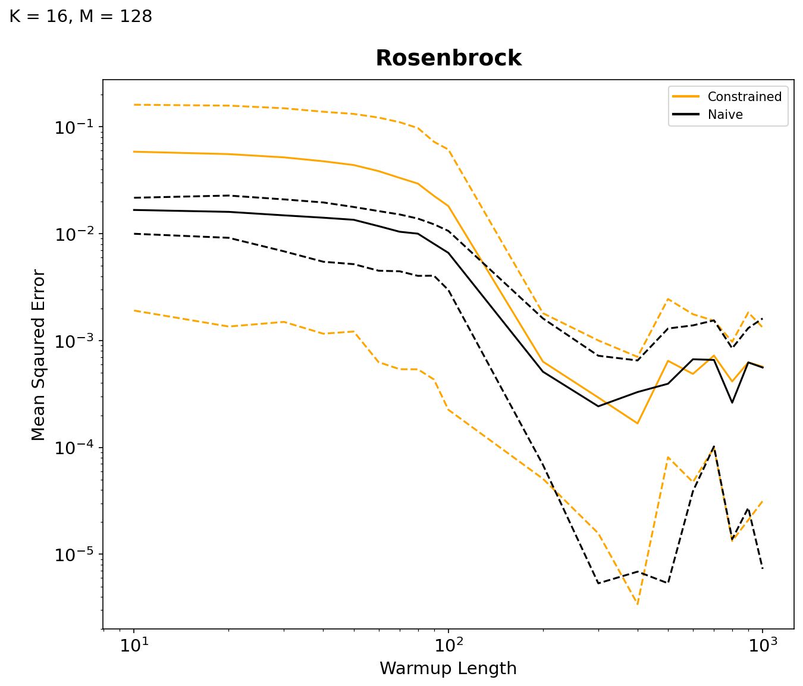

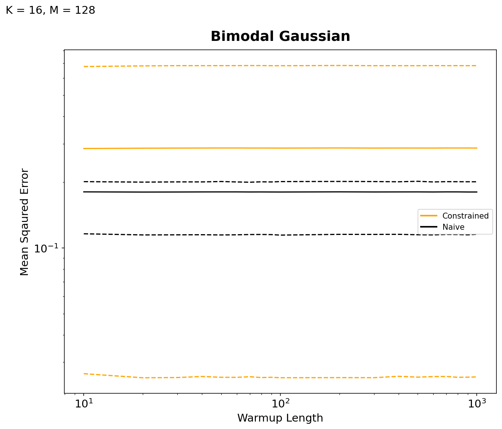

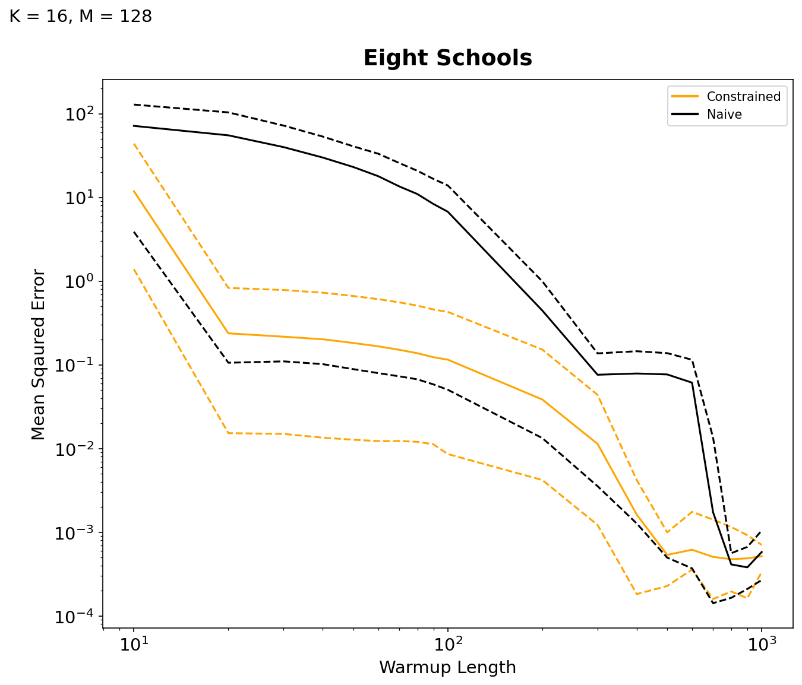

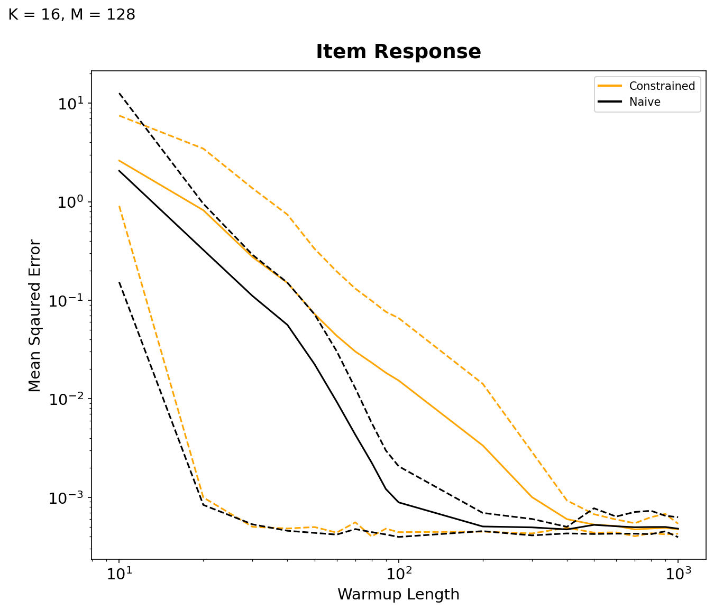
:::

### Scaled Squared Error vs. Nested $\widehat{R}$, under Constrained intialization
::: {layout-nrow=2}
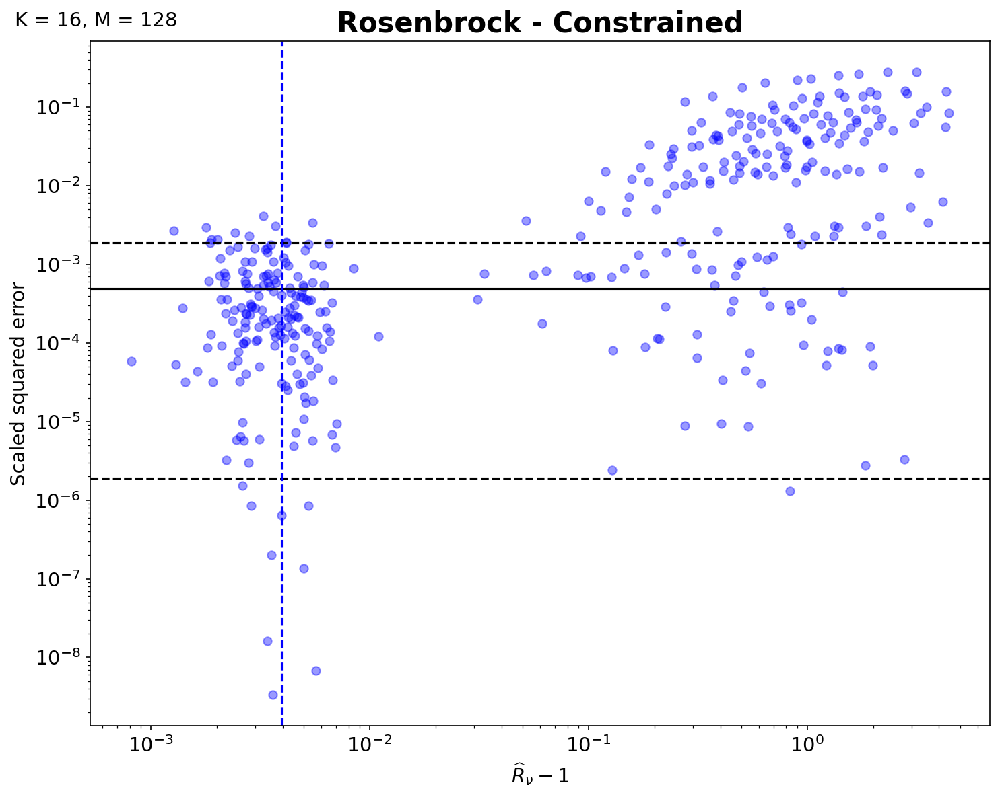

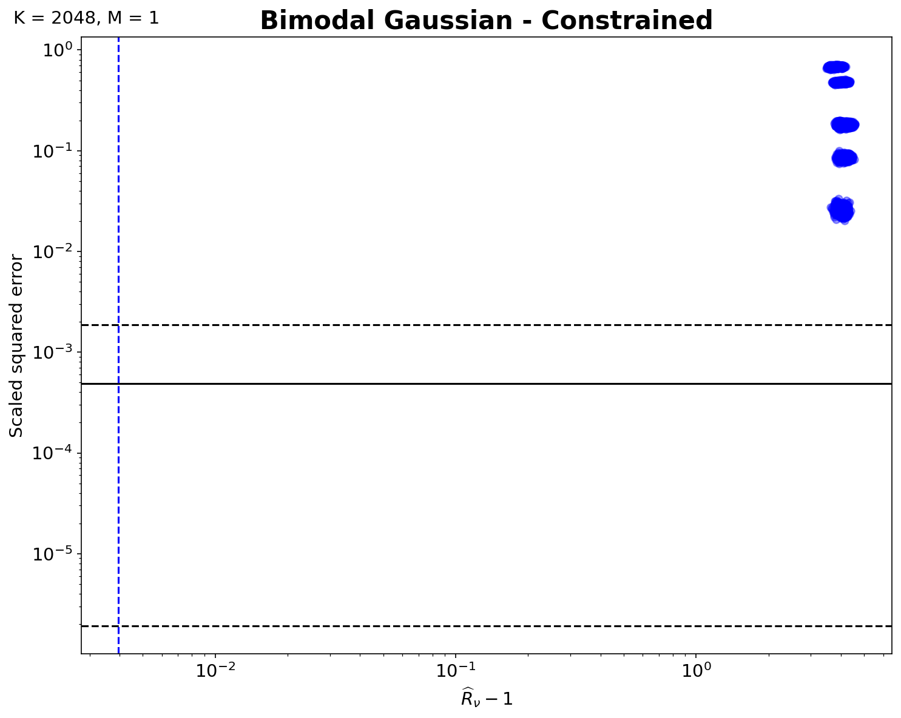

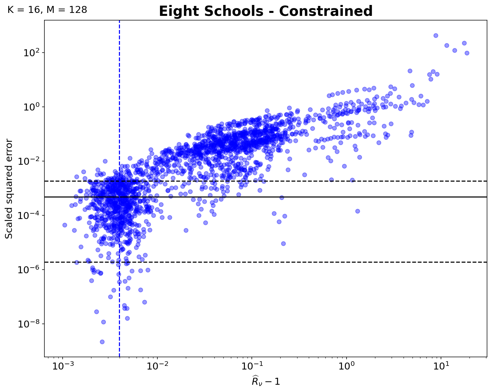

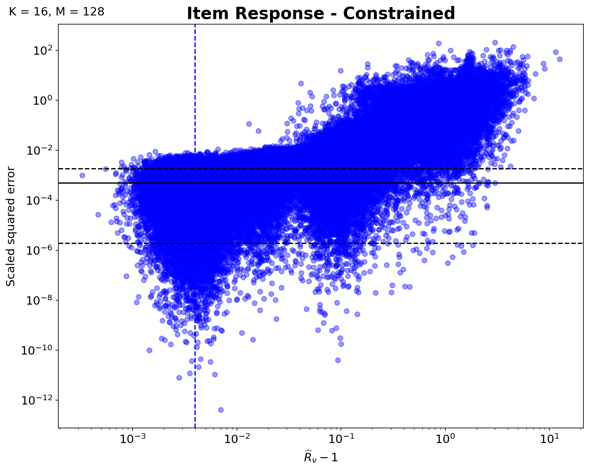
:::

### Scaled Squared Error vs. Nested $\widehat{R}$, under Naive intialization
::: {layout-nrow=2}
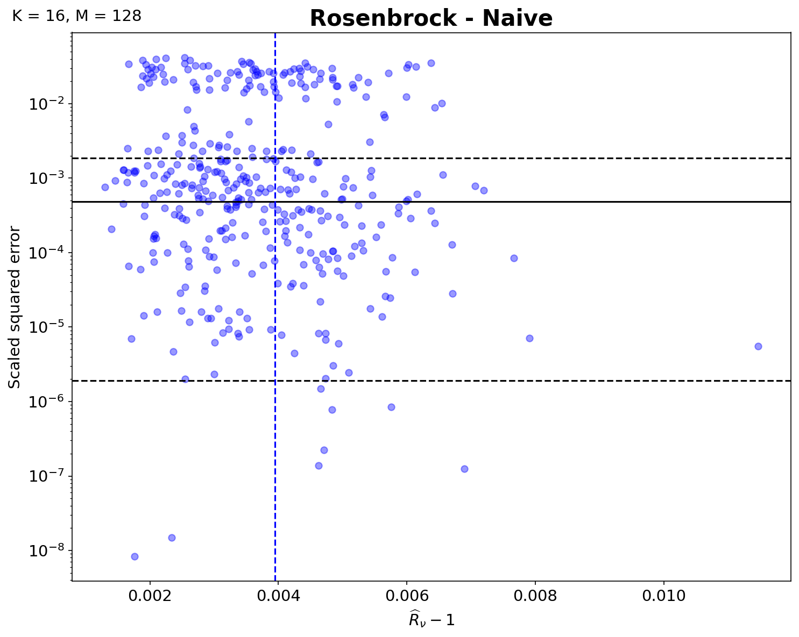

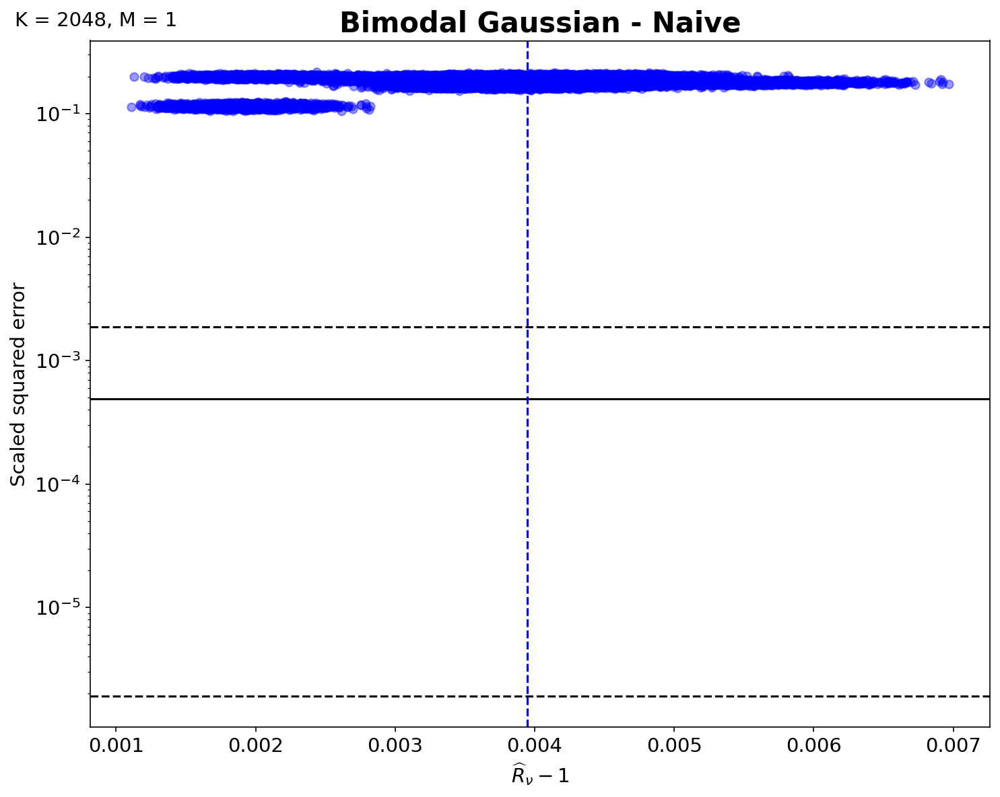

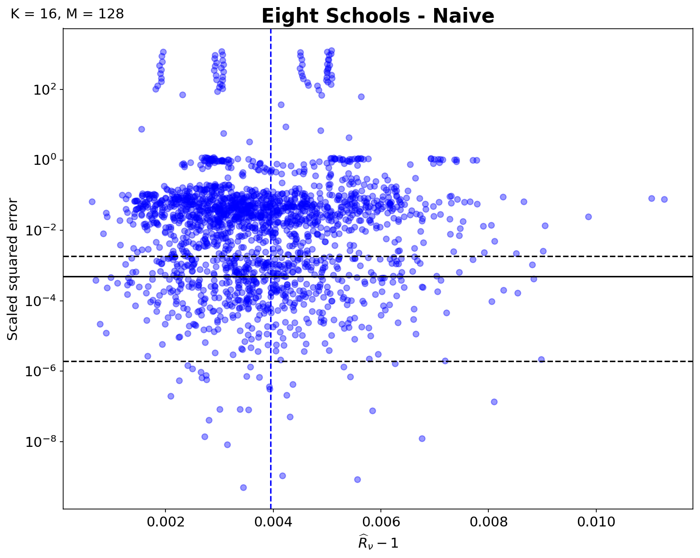

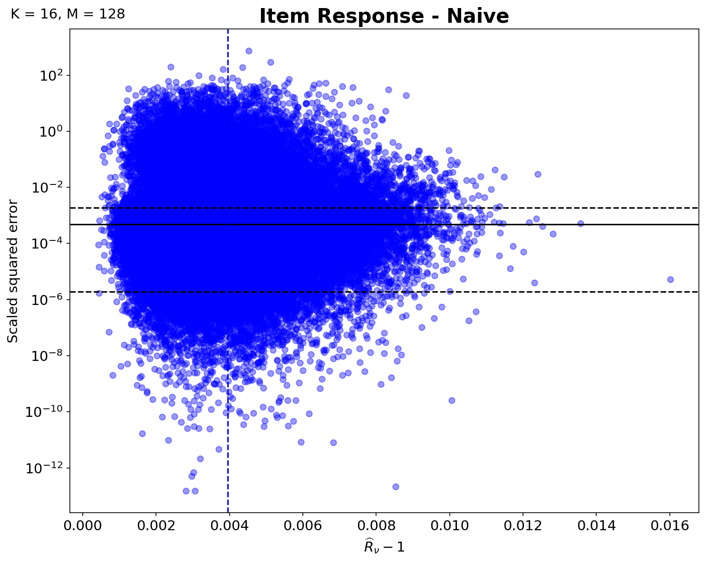
:::

## What Did We Learn?

[Short interpretation.]

## The Next Question

> Is the observed behavior specific to the computational framework?