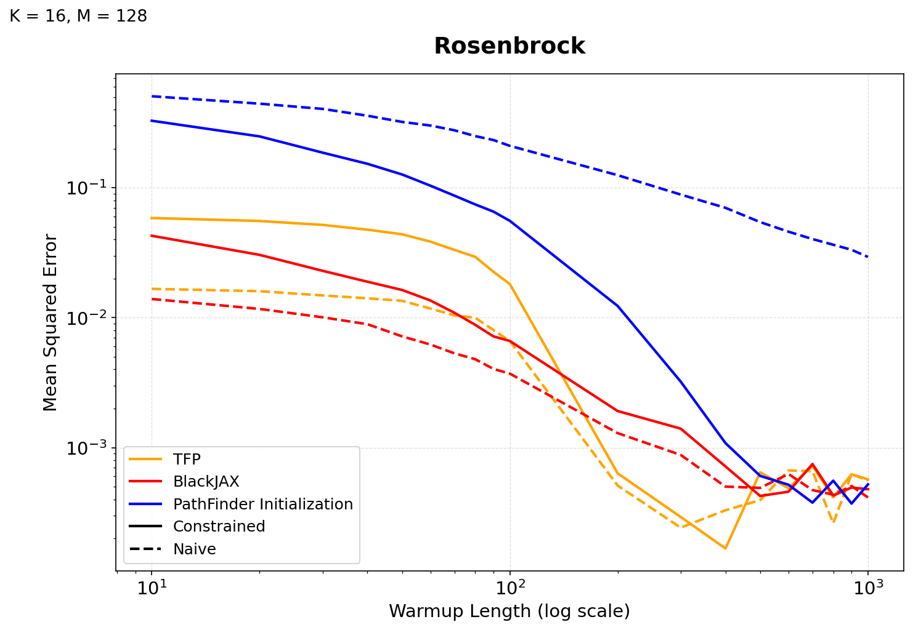
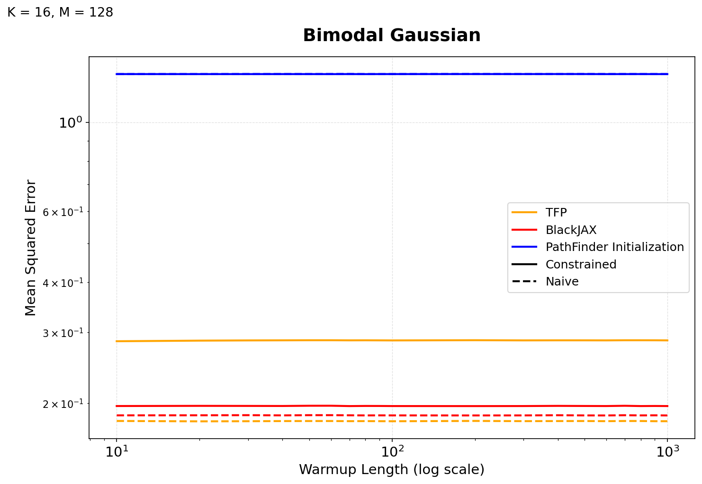
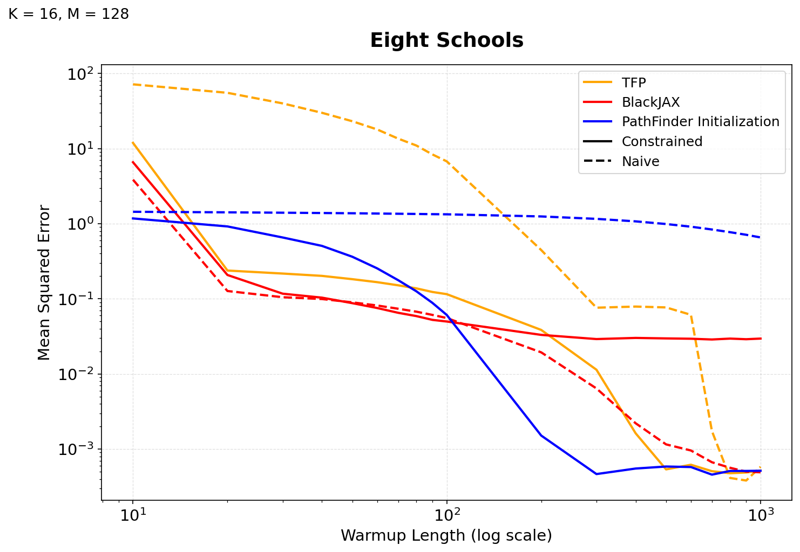
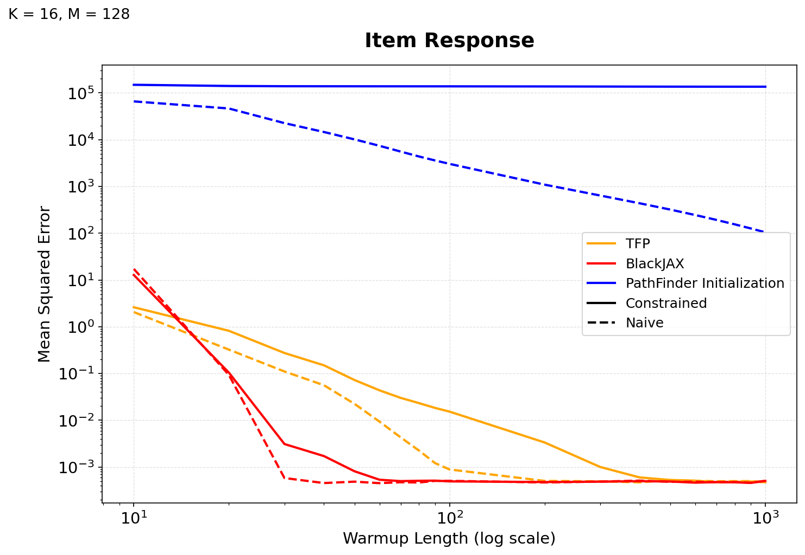
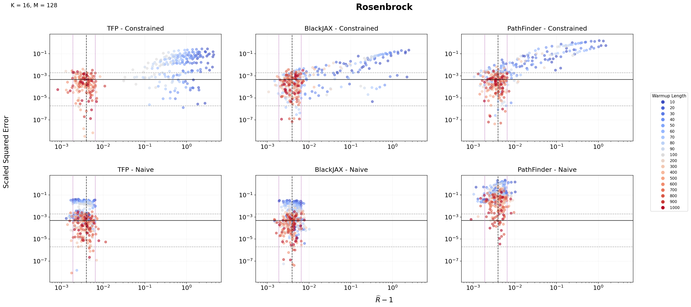
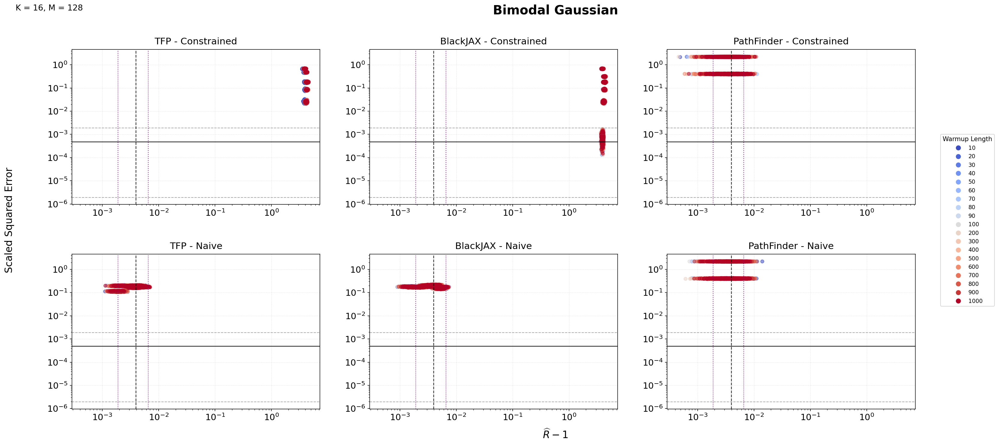
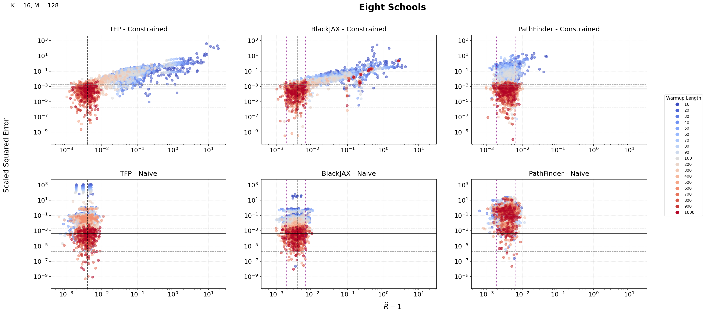
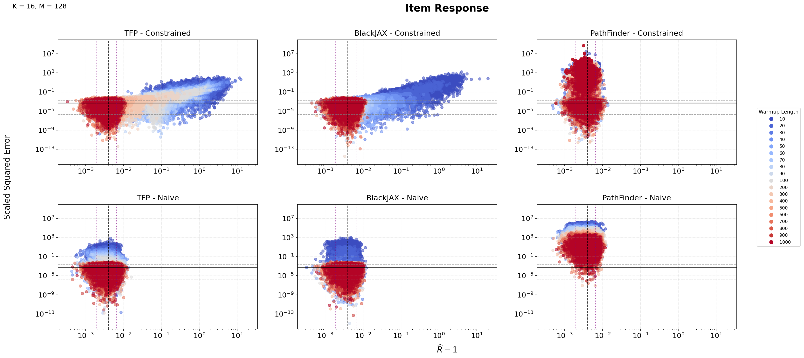

# Is the Computational Framework Responsible?

## Why Change Frameworks?

[Explain the motivation.]

## Moving to BlackJAX

[Briefly explain the transition.]

## Repeating the Experiments

## Comparing Frameworks

::: {layout-nrow=2}

:::

### Warmup-Coloring

::: {layout-nrow=4}

:::

## Interpretation

[What remains consistent?]

## The Next Question

> If initialization matters, what exactly is initialization doing?