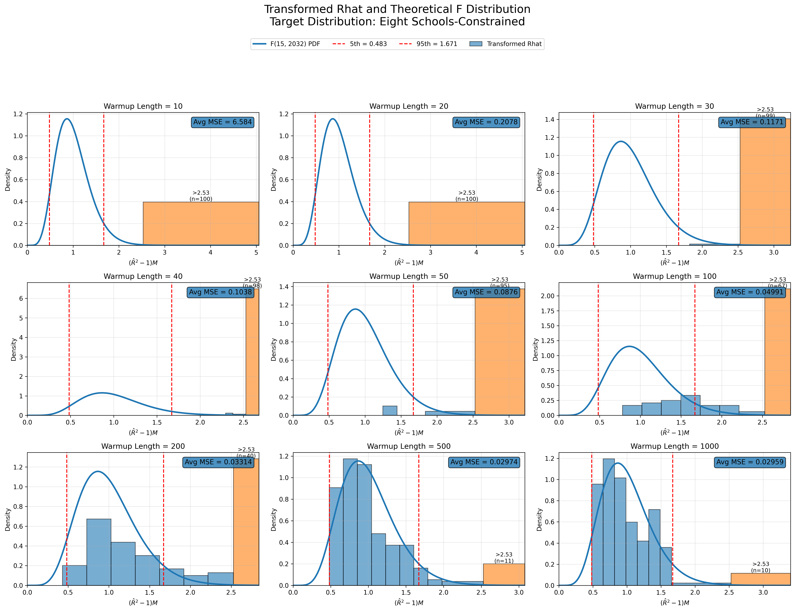
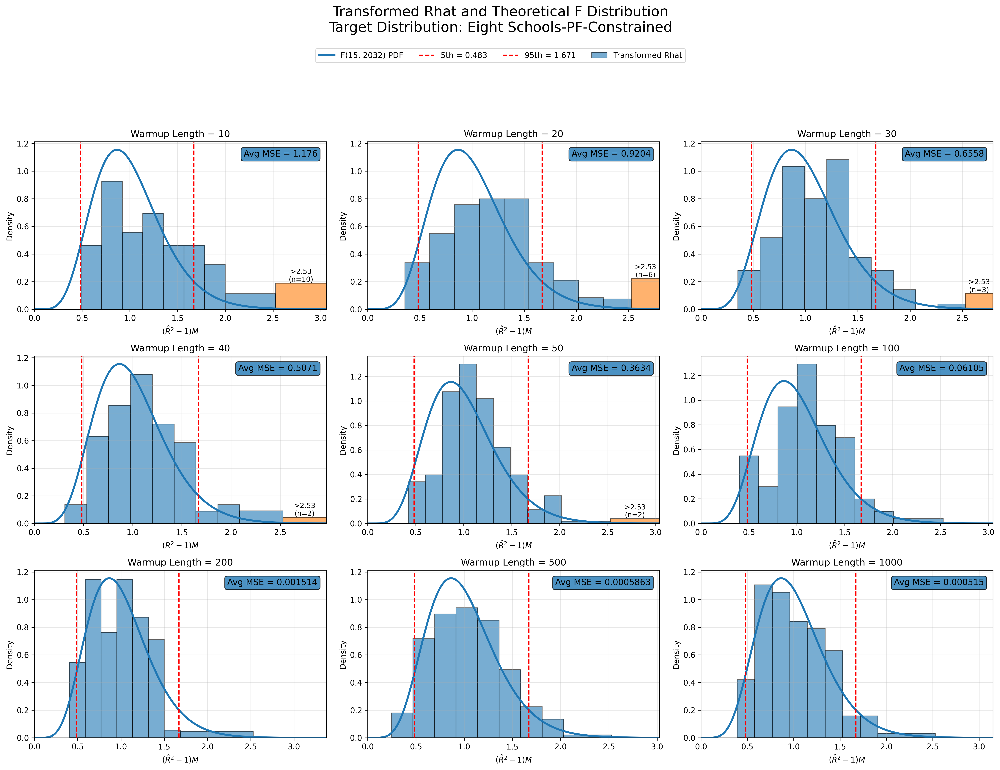
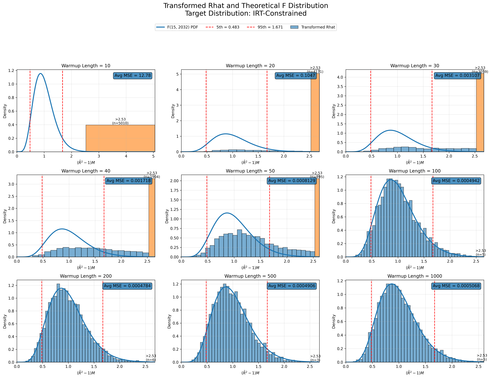
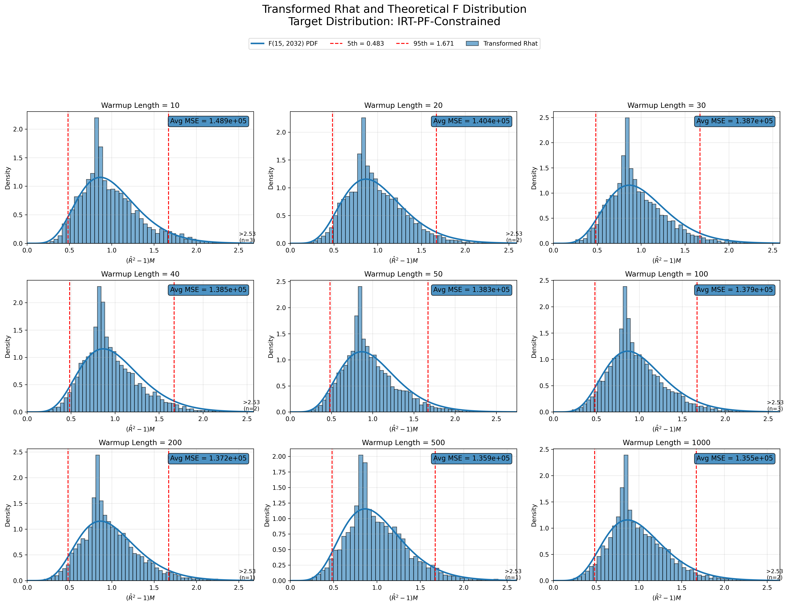
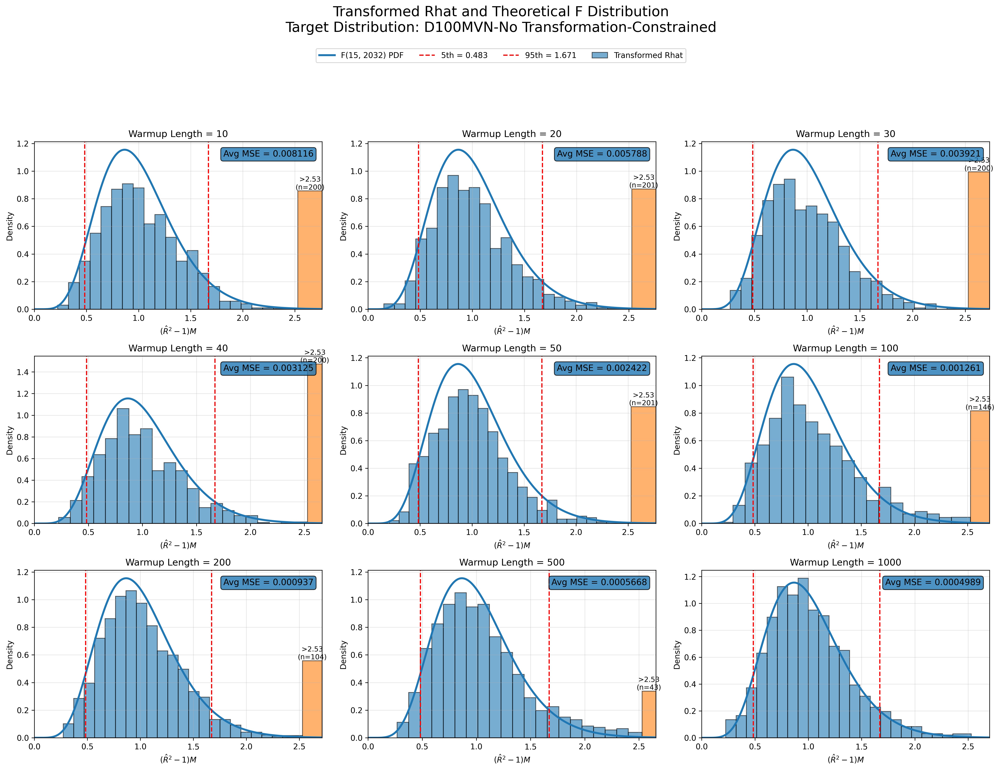
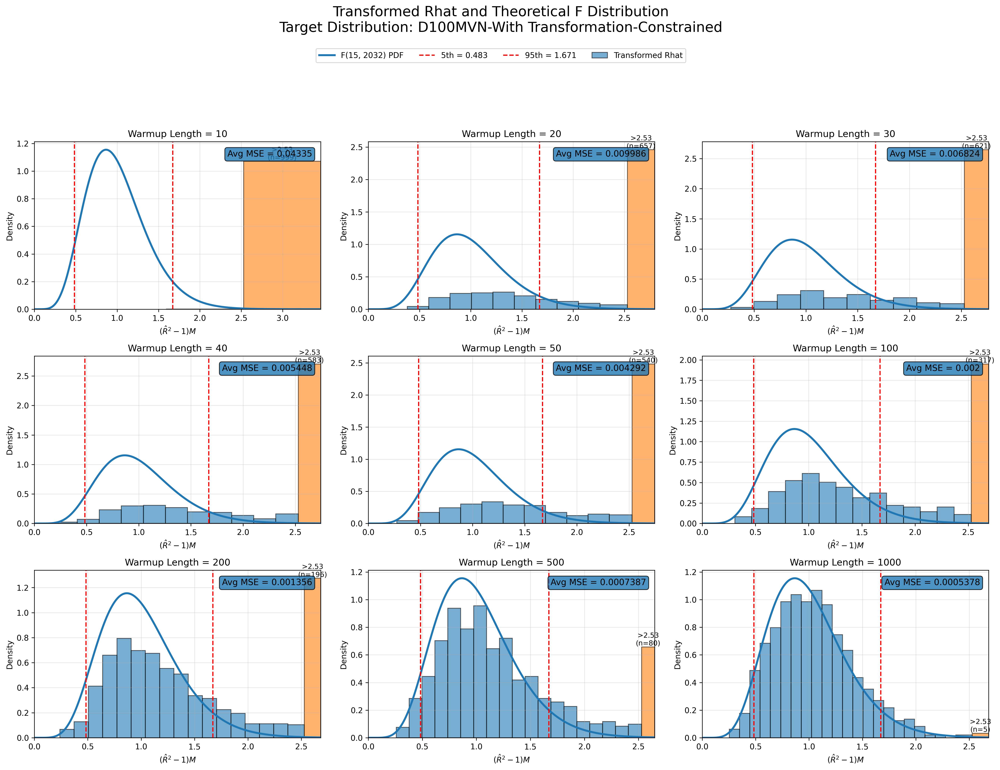
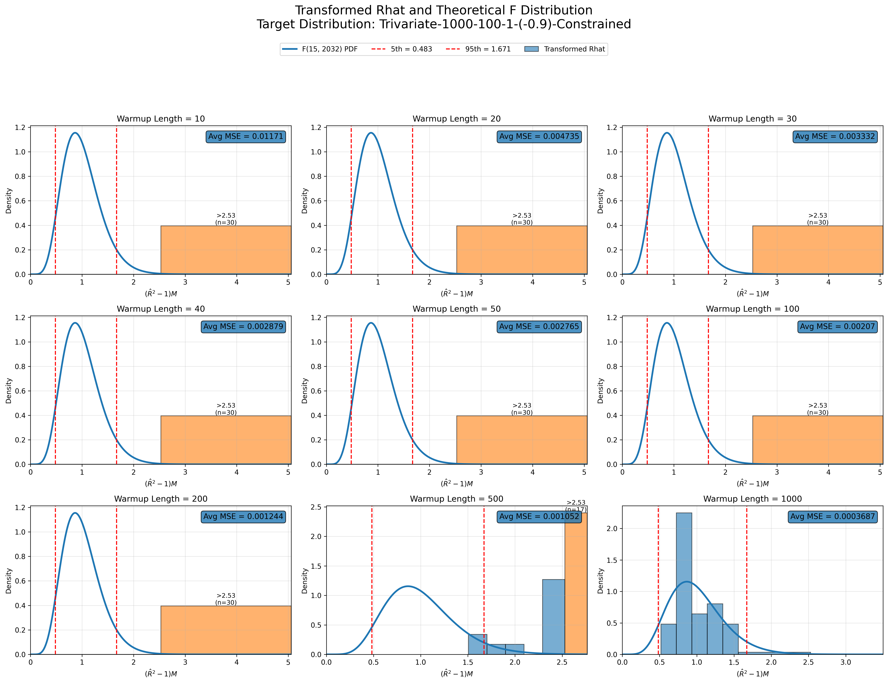
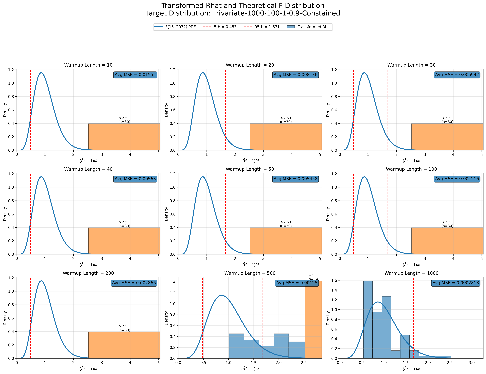

# What Do We Know?

## Distribution of diagnostics

[Explain the conceptual transition.]

## Plots

### Histograms

#### Eight Schools distribution
::: {layout-nrow=2}

:::

#### Item Response distribution
::: {layout-nrow=2}

:::

#### D100 normal distribution
::: {layout-nrow=2}

:::

#### Trivariate distribution
::: {layout-nrow=2}

:::

## An Open Question

[Explain what you don't yet understand.]

## Moving Toward Controlled Experiments

[Why MVNs are the next step.]