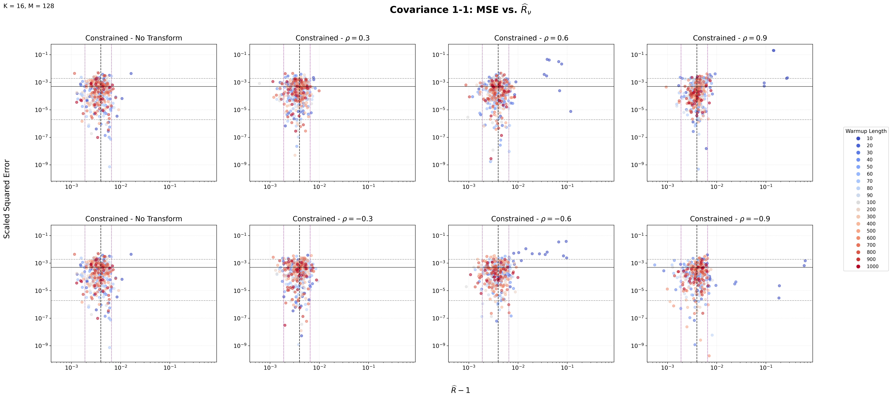
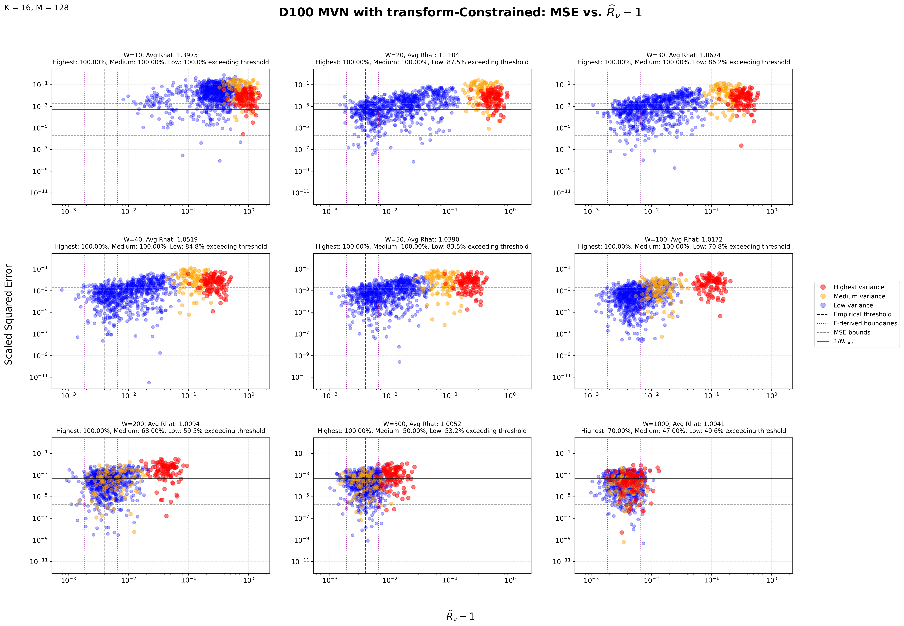

## **Why Multivariate Normal Distributions?**

[Explain why controlled distributions are useful.]

## **The Experimental Strategy**

We systematically vary:

- dimensionality,
- variance structure,
- correlation structure,
- anisotropy,
- coordinate representation.

The main quantities of interest are:

- warmup length,
- nested $\widehat{R}$,
- mean squared error.

## **1. Bivariate Normal Distributions**

### Bivariate covariance structures

Select the two variables to display their corresponding covariance plot.

::: {.controls}
<label class="toggle">
  <input type="checkbox" id="colored-toggle" onchange="toggleColored()">
  
  Colored version
</label>
:::

::: {.button-container}
<button class="cov-button active" onclick="showPlot('1-1')">1-1</button>
<button class="cov-button" onclick="showPlot('10-1')">10-1</button>
<button class="cov-button" onclick="showPlot('10-10')">10-10</button>
<button class="cov-button" onclick="showPlot('100-1')">100-1</button>
<button class="cov-button" onclick="showPlot('100-10')">100-10</button>
<button class="cov-button" onclick="showPlot('100-100')">100-100</button>
<button class="cov-button" onclick="showPlot('1000-1')">1000-1</button>
<button class="cov-button" onclick="showPlot('1000-10')">1000-10</button>
<button class="cov-button" onclick="showPlot('1000-100')">1000-100</button>
<button class="cov-button" onclick="showPlot('1000-1000')">1000-1000</button>
:::

::: {.plot-panel}

:::

## **2. Trivariate Normal**

[Explanation]

[Figure]

## **3. 100-Dimensional MVN**

[Explanation]

### Highlight Plots

::: {layout-nrow=2}

:::

## **What Are We Looking For?**

We are looking for the connection between the MSE vs. $\widehat{R}_{\nu}$ on different distributions.