## **Why Multivariate Normal Distributions?**

[Explain why controlled distributions are useful.]

## **The Experimental Strategy**

We systematically vary:

- dimensionality,
- variance structure,
- correlation structure,
- anisotropy,
- coordinate representation.

The main quantities of interest are:

- warmup length,
- nested $\widehat{R}$,
- mean squared error.

## **1. Bivariate Normal Distributions**

### Varying Covariance Structures

  <button class="cov-btn" data-config="1-1">$\sigma_1 = 1,\ \sigma_2 = 1$</button>
  <button class="cov-btn" data-config="10-1">$\sigma_1 = 10,\ \sigma_2 = 1$</button>
  <button class="cov-btn" data-config="10-10">$\sigma_1 = 10,\ \sigma_2 = 10$</button>
  <button class="cov-btn" data-config="100-1">$\sigma_1 = 100,\ \sigma_2 = 1$</button>
  <button class="cov-btn" data-config="100-10">$\sigma_1 = 100,\ \sigma_2 = 10$</button>
  <button class="cov-btn" data-config="100-100">$\sigma_1 = 100,\ \sigma_2 = 100$</button>
  <button class="cov-btn" data-config="1000-1">$\sigma_1 = 1000,\ \sigma_2 = 1$</button>
  <button class="cov-btn" data-config="1000-10">$\sigma_1 = 1000,\ \sigma_2 = 10$</button>
  <button class="cov-btn" data-config="1000-100">$\sigma_1 = 1000,\ \sigma_2 = 100$</button>
  <button class="cov-btn" data-config="1000-1000">$\sigma_1 = 1000,\ \sigma_2 = 1000$</button>

  

### Varying Initialization Distribution

#### Warmup Length Transition:
$$
\begin{bmatrix}
  1000 & \rho*\sqrt{1000} \\
  \rho*\sqrt{1000} & 1\\
\end{bmatrix}
$$

::: {layout-nrow=3}
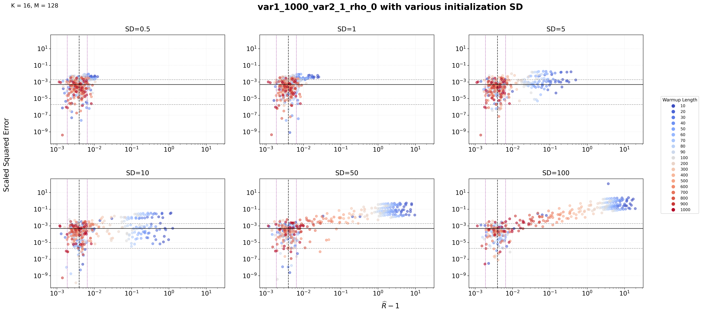

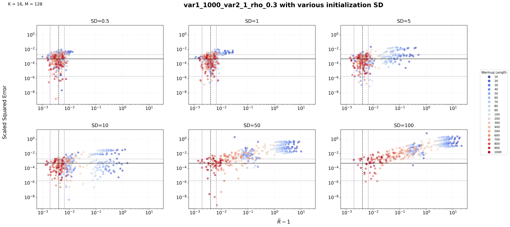

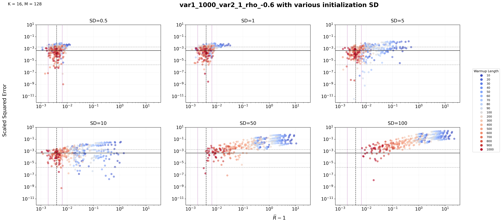

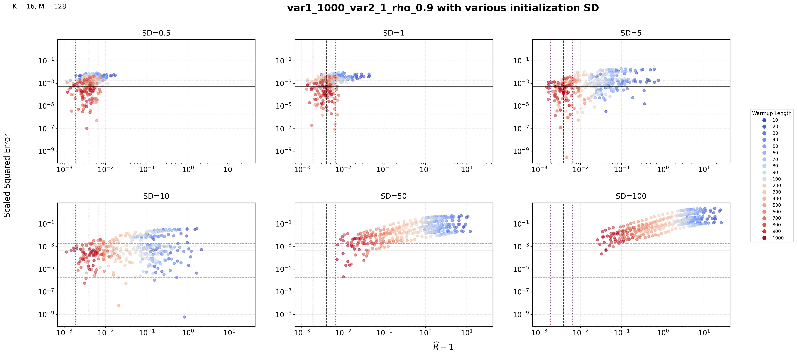

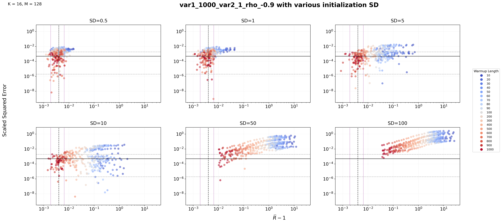
:::

#### Histogram Transition:
::: {layout-nrow=3}
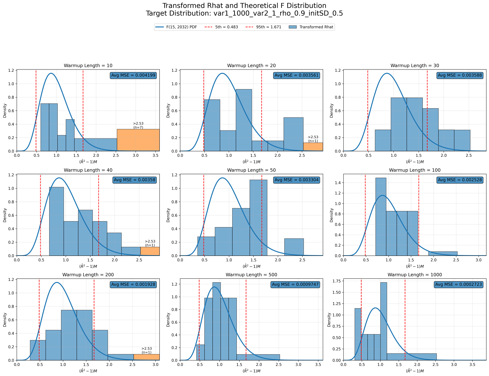

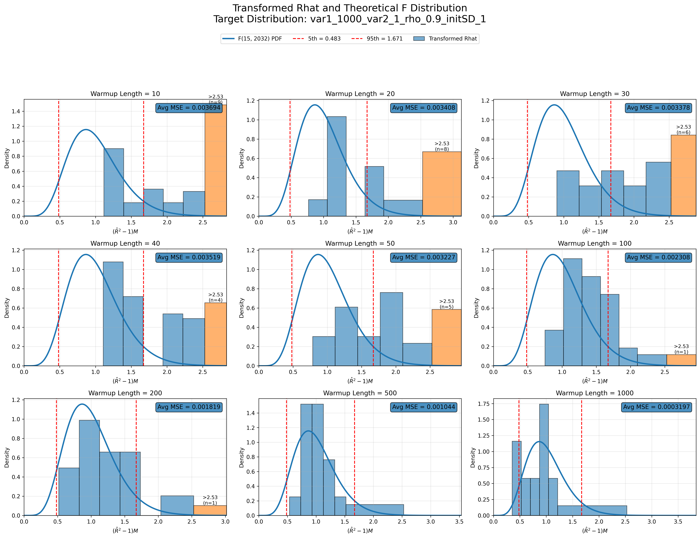

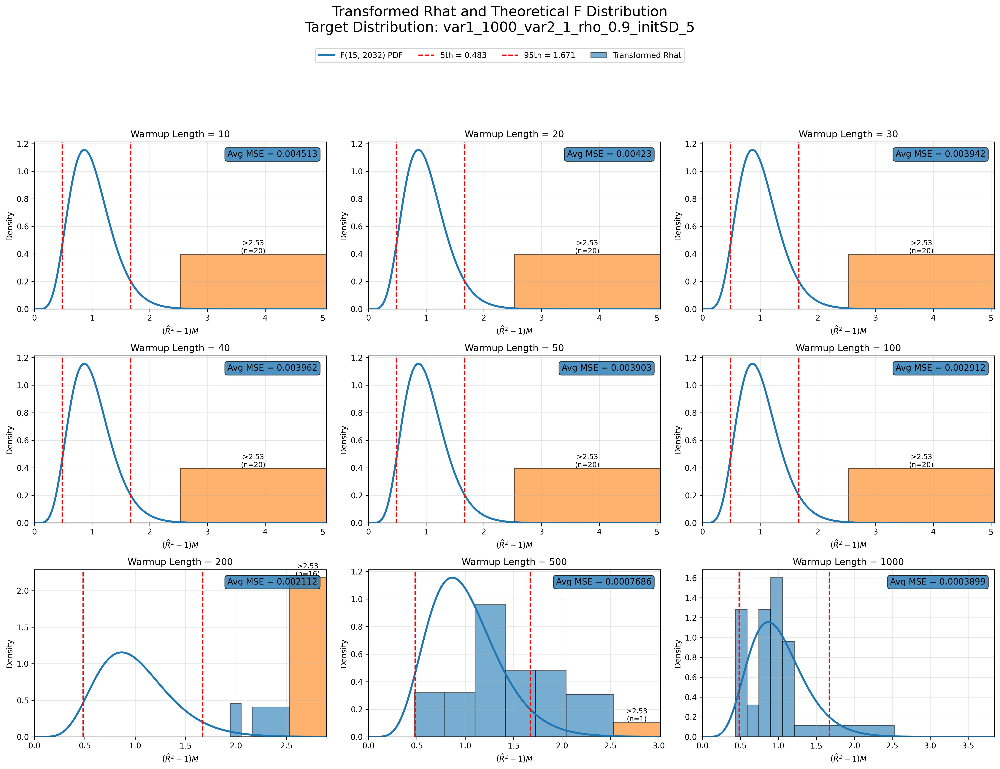

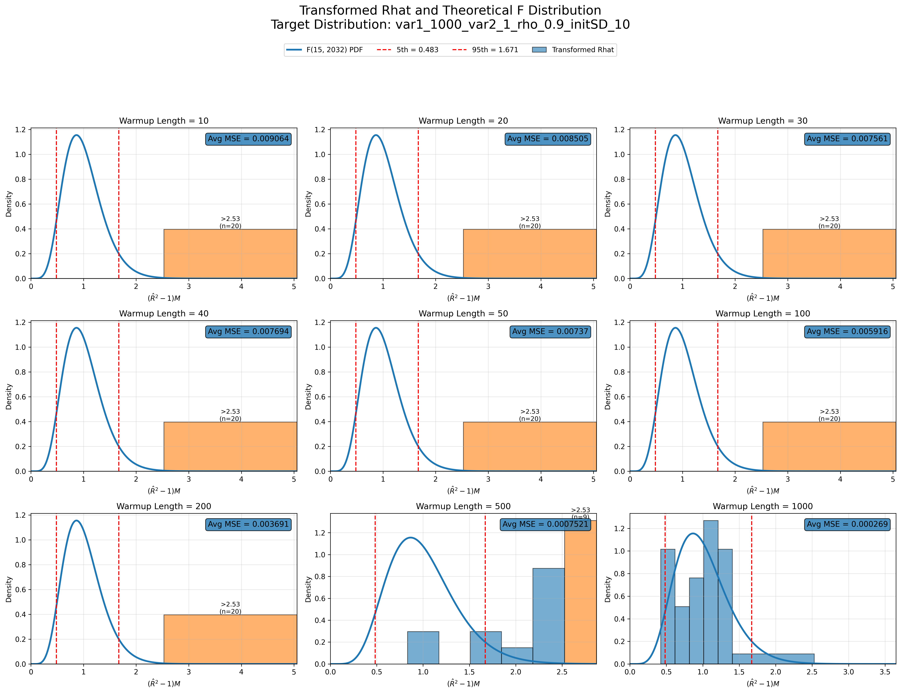

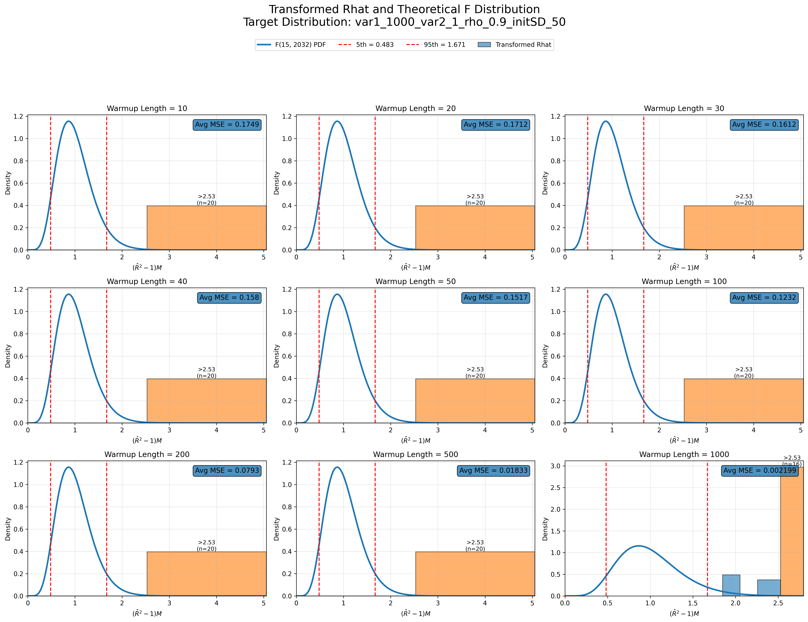

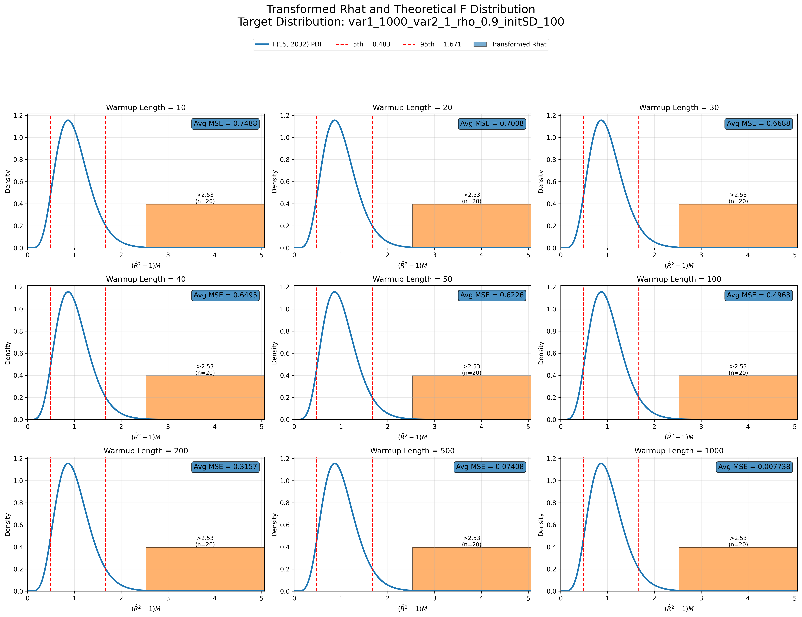
:::

## **2. Trivariate Normal**

### Varying Covariance Structures
::: {layout-nrow=2}
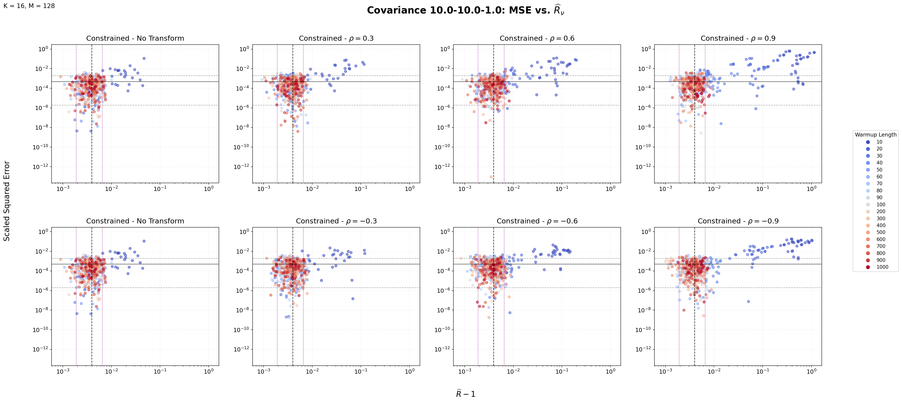
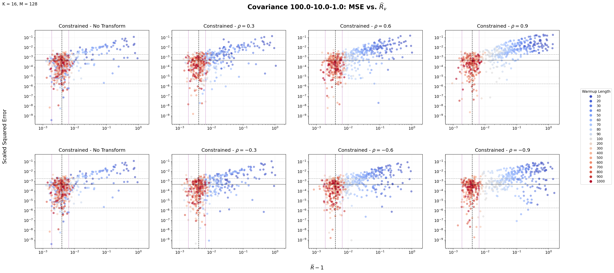
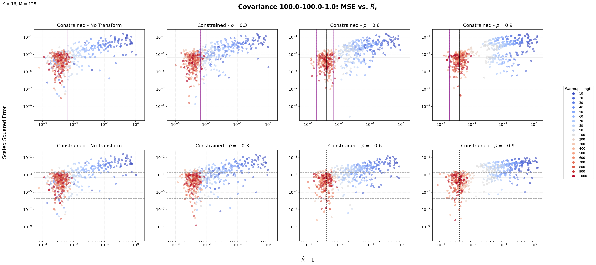
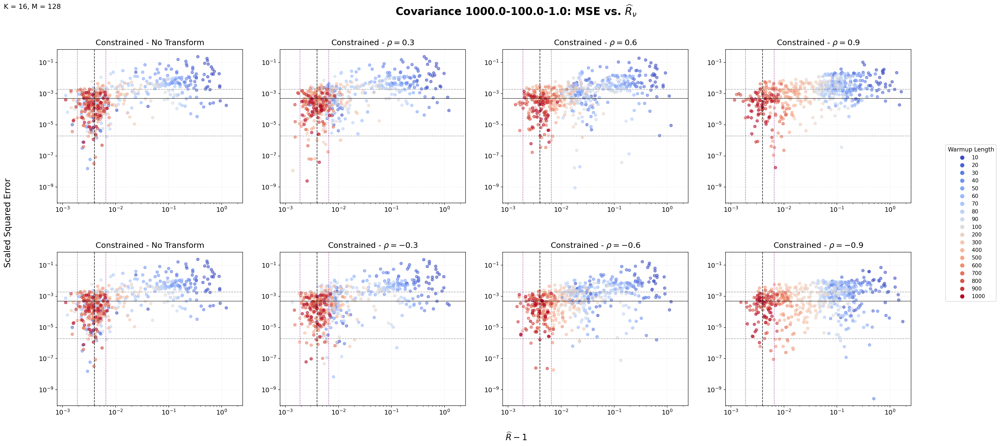
:::

### Varying Initialization Distribution

## **3. 100-Dimensional MVN**

[Explanation]

### Highlight Plots

::: {layout-nrow=2}

:::

## **What Are We Looking For?**

We are looking for the connection between the MSE vs. $\widehat{R}_{\nu}$ on different distributions.