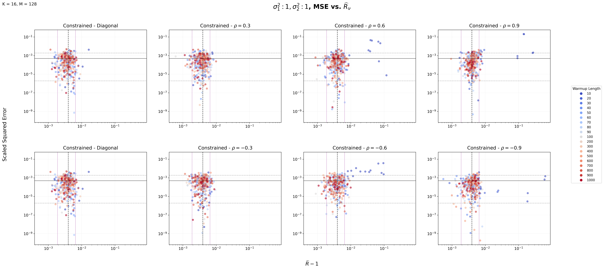
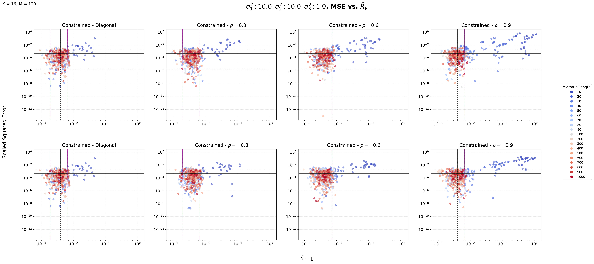
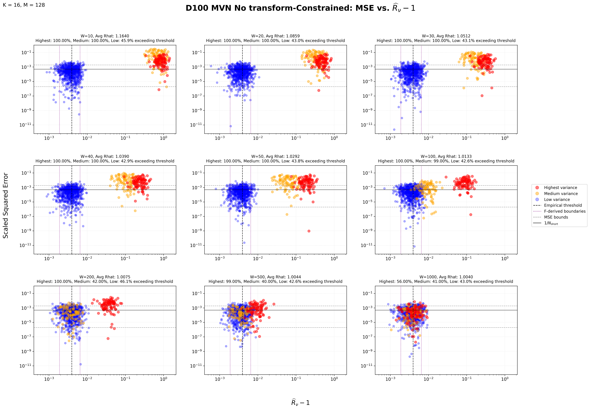

## **Why Multivariate Normal Distributions?**

[Explain why controlled distributions are useful.]

## **The Experimental Strategy**

We systematically vary:

- dimensionality,
- variance structure,
- correlation structure,
- anisotropy,
- coordinate representation.

The main quantities of interest are:

- warmup length,
- nested $\widehat{R}$,
- mean squared error.

## **1. Bivariate Normal Distributions**

### Varying Covariance Structures

  <button class="cov-btn" data-config="1-1">$\sigma_1^2 = 1,\ \sigma_2^2 = 1$</button>
  <button class="cov-btn" data-config="10-1">$\sigma_1^2 = 10,\ \sigma_2^2 = 1$</button>
  <button class="cov-btn" data-config="100-1">$\sigma_1^2 = 100,\ \sigma_2^2 = 1$</button>
  <button class="cov-btn" data-config="1000-1">$\sigma_1^2 = 1000,\ \sigma_2^2 = 1$</button>
  <button class="cov-btn" data-config="10-10">$\sigma_1^2 = 10,\ \sigma_2^2 = 10$</button>
  <button class="cov-btn" data-config="100-10">$\sigma_1^2 = 100,\ \sigma_2^2 = 10$</button>
  <button class="cov-btn" data-config="1000-10">$\sigma_1^2 = 1000,\ \sigma_2^2 = 10$</button>
  <button class="cov-btn" data-config="100-100">$\sigma_1^2 = 100,\ \sigma_2^2 = 100$</button>
  <button class="cov-btn" data-config="1000-100">$\sigma_1^2 = 1000,\ \sigma_2^2 = 100$</button>
  <button class="cov-btn" data-config="1000-1000">$\sigma_1^2 = 1000,\ \sigma_2^2 = 1000$</button>

  

### Varying Initialization Distribution

*Use this tool to visualize how the target distribution and Initialzation distribution changes*

The following visualization shows the 68% and 95% probability
regions of two bivariate normal distributions.

## **2. Trivariate Normal**

### Varying Covariance Structures

  <button class="tri-btn" data-config="10-10-1">$\sigma_1^2 = 10,\ \sigma_2^2 = 10,\ \sigma_3^2 = 1$</button>
  <button class="tri-btn" data-config="100-10-1">$\sigma_1^2 = 100,\ \sigma_2^2 = 10,\ \sigma_3^2 = 1$</button>
  <button class="tri-btn" data-config="100-100-1">$\sigma_1^2 = 100,\ \sigma_2^2 = 100,\ \sigma_3^2 = 1$</button>
  <button class="tri-btn" data-config="1000-100-1">$\sigma_1^2 = 1000,\ \sigma_2^2 = 100,\ \sigma_3^2 = 1$</button>

  

### Varying Initialization Distribution

## **3. 100-Dimensional MVN**

[Explanation]

### Highlight Plots

  <button class="d100-btn" data-image="noTransform">Diagonal</button>
  <button class="d100-btn" data-image="withTransform">Transformed</button>

  

## **What Are We Looking For?**

We are looking for the connection between the MSE vs. $\widehat{R}_{\nu}$ on different distributions.